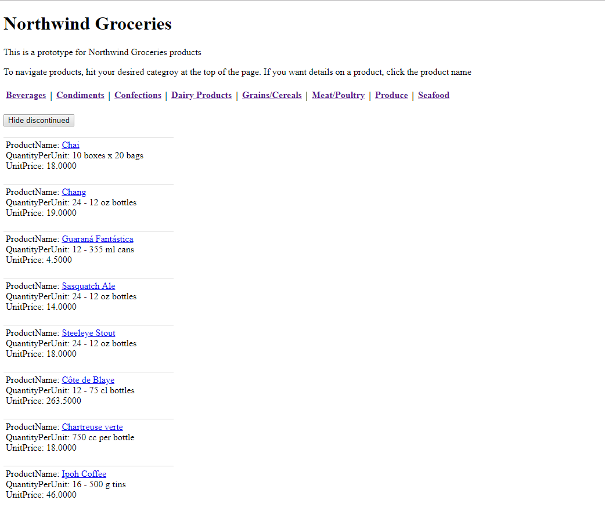
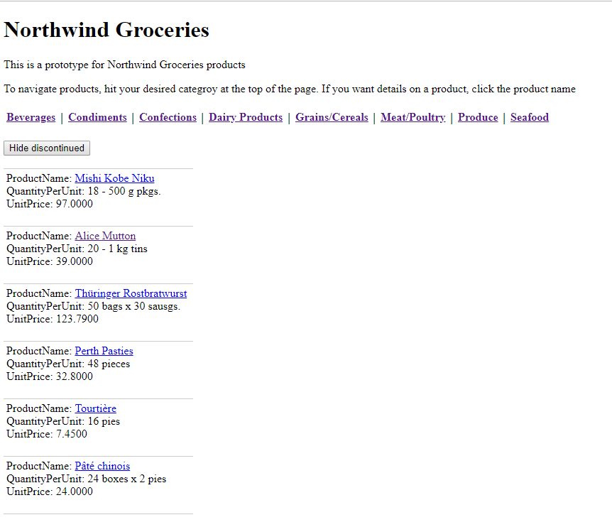
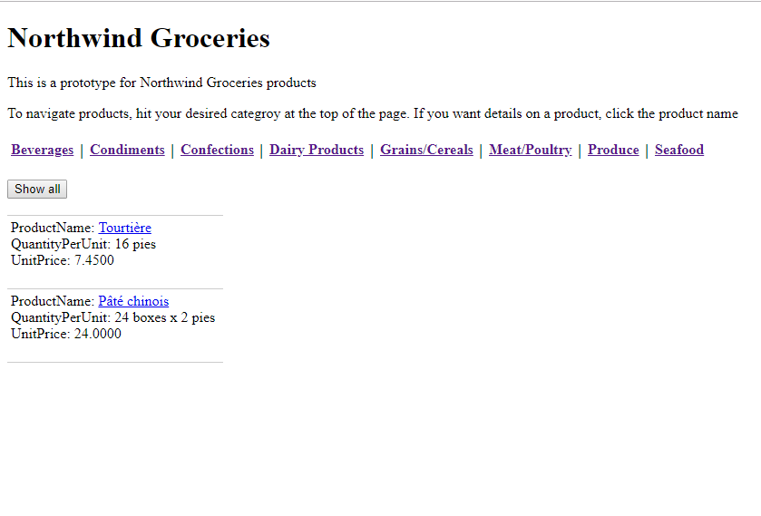
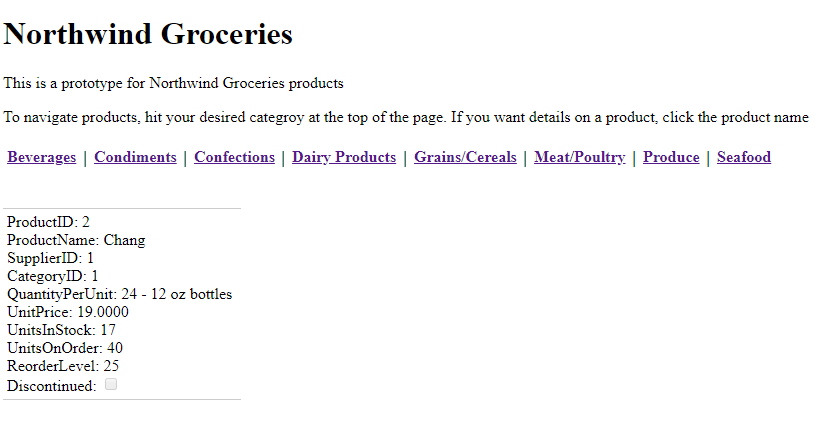

# Northwind Groceries ASP.net website with Norhtwind Database
Data driven asp.net website with Northwind Database

## Features
* Microsoft SQL Server 2017
* .Net 4.5 framework
* Retrives the catergorires, products from database
* Dynamic creation of Category navigation link
* Dynamic navigation to product related to category

## Contents
* [Main page](#main-page)
* [Discountiued Item Filtering](#discountiued-item-filtering)
* [Detail Page](#detail-page)

## Main Page


#### Navigation
Uses the database to assist in dynamic creation of the Category navigation links
```HTML
<nav>
    <asp:DataList ID="DataList1" runat="server" DataSourceID="SqlDataSource1" RepeatDirection="Horizontal" DataKeyField="CategoryID" CellPadding="2" CellSpacing="2" Font-Bold="True" Font-Italic="False" Font-Overline="False" Font-Size="Larger" Font-Strikeout="False" Font-Underline="False">
        <ItemStyle Font-Size="Medium" Wrap="False" />
        <ItemTemplate>
            <asp:HyperLink ID="HyperLink1" runat="server" Navigateurl='<%# Eval("CategoryID", "~/Default.aspx?id={0}")%>' Text='<%# Eval("CategoryName") %>'></asp:HyperLink>  
        </ItemTemplate>
        <SeparatorTemplate> | </SeparatorTemplate>
        <SelectedItemStyle Font-Names="Arial Black" />
    
    </asp:DataList>
    <asp:SqlDataSource ID="SqlDataSource1" runat="server" ConnectionString="<%$ ConnectionStrings:NorthwindConnectionString %>" SelectCommand="SELECT [CategoryName], [CategoryID] FROM [Categories]"></asp:SqlDataSource>
    <br />
</nav>
```

#### Product list
Uses a ListView control to display the Product List 
```HTML
<asp:DataList ID="DataList1" runat="server" DataSourceID="SqlDataSource2" DataKeyField="ProductID" BackColor="White" BorderColor="#CCCCCC" BorderStyle="None" BorderWidth="1px" CellPadding="4" ForeColor="Black" GridLines="Horizontal">
    <FooterStyle BackColor="#CCCC99" ForeColor="Black" />
    <HeaderStyle BackColor="#333333" Font-Bold="True" ForeColor="White" />
<ItemTemplate>
    ProductName:
    <asp:HyperLink ID="HyperLink2" runat="server" Navigateurl='<%# Eval("ProductID","~/Detail.aspx?id={0}") %>' Text='<%# Eval("ProductName") %>' >HyperLink</asp:HyperLink>
    <br />
    QuantityPerUnit:
    <asp:Label ID="QuantityPerUnitLabel" runat="server" Text='<%# Eval("QuantityPerUnit") %>' />
    <br />
    UnitPrice:
    <asp:Label ID="UnitPriceLabel" runat="server" Text='<%# Eval("UnitPrice") %>' />
    <br />
    <br />
</ItemTemplate>
    <SelectedItemStyle BackColor="#CC3333" Font-Bold="True" ForeColor="White" />
</asp:DataList>

<%-- Just for debugging purpose, retrieved extra column.--%>
<asp:SqlDataSource ID="SqlDataSource2" runat="server" ConnectionString="<%$ ConnectionStrings:NorthwindConnectionString %>" SelectCommand="SELECT [ProductName], [CategoryID], [QuantityPerUnit], [ProductID], [UnitPrice], [Discontinued] FROM [Products] WHERE ([CategoryID] = @CategoryID)">
    <SelectParameters>
<%--  <asp:QueryStringParameter Name="CategoryID" QueryStringField="id" Type="Int32"/>--%>
        <asp:QueryStringParameter Name="CategoryID" QueryStringField="id" Type="Int32" DefaultValue="1"/>
    </SelectParameters>
</asp:SqlDataSource>
```
--

## Discountiued Item Filtering
Show/hide the products that are discontinued



#### Button
```HTML
<asp:Button ID="btnHideDiscountiue" runat="server" Text="Hide discontinued" OnClick="btnHideDiscountiue_Click" />
<asp:Button ID="btnShowAll" runat="server" Text="Show all" OnClick="btnShowAll_Click" Visible="False" />
```

#### Code Behind
```csharp
protected void btnHideDiscountiue_Click(object sender, EventArgs e)
{
    // If Hide Discontinue button click then
    //      Shows only Discontinue is false
    //      Hide discontinue button invisible
    //      Show All button visible
    SqlDataSource2.SelectCommand = "SELECT[ProductName], [CategoryID], [QuantityPerUnit], [ProductID], [UnitPrice], [Discontinued] FROM[Products] WHERE([CategoryID] = @CategoryID) AND [Discontinued] = 0";
    btnHideDiscountiue.Visible = false;
    btnShowAll.Visible = true;
            
}

protected void btnShowAll_Click(object sender, EventArgs e)
{
    // If Show all button click then
    //    show all product whether discontinue or not
    //    Hide discontinue button visible
    //    Show all button invisible
    //    page reloading to before button click (current URL)
    btnHideDiscountiue.Visible = true;
    btnShowAll.Visible = false;
    Response.Redirect(Request.RawUrl);
}
```
--
### Detail Page
Show full detail of item

```HTML
<asp:FormView ID="FormView1" runat="server" DataKeyNames="ProductID" DataSourceID="SqlDataSource3" CellPadding="4" ForeColor="Black" BackColor="White" BorderColor="#CCCCCC" BorderStyle="None" BorderWidth="1px" GridLines="Horizontal">

    <ItemTemplate>
        ProductID:
        <asp:Label ID="ProductIDLabel" runat="server" Text='<%# Eval("ProductID") %>' />
        <br />
        ProductName:
        <asp:Label ID="ProductNameLabel" runat="server" Text='<%# Bind("ProductName") %>' />
        <br />
        SupplierID:
        <asp:Label ID="SupplierIDLabel" runat="server" Text='<%# Bind("SupplierID") %>' />
        <br />
        CategoryID:
        <asp:Label ID="CategoryIDLabel" runat="server" Text='<%# Bind("CategoryID") %>' />
        <br />
        QuantityPerUnit:
        <asp:Label ID="QuantityPerUnitLabel" runat="server" Text='<%# Bind("QuantityPerUnit") %>' />
        <br />
        UnitPrice:
        <asp:Label ID="UnitPriceLabel" runat="server" Text='<%# Bind("UnitPrice") %>' />
        <br />
        UnitsInStock:
        <asp:Label ID="UnitsInStockLabel" runat="server" Text='<%# Bind("UnitsInStock") %>' />
        <br />
        UnitsOnOrder:
        <asp:Label ID="UnitsOnOrderLabel" runat="server" Text='<%# Bind("UnitsOnOrder") %>' />
        <br />
        ReorderLevel:
        <asp:Label ID="ReorderLevelLabel" runat="server" Text='<%# Bind("ReorderLevel") %>' />
        <br />
        Discontinued:
        <asp:CheckBox ID="DiscontinuedCheckBox" runat="server" Checked='<%# Bind("Discontinued") %>' Enabled="false" />
        <br />
    </ItemTemplate>
    <PagerStyle BackColor="White" ForeColor="Black" HorizontalAlign="Right" />

</asp:FormView>

<%-- Product ID uses as Query string parameter instead of product name --%>
<asp:SqlDataSource ID="SqlDataSource3" runat="server" ConnectionString="<%$ ConnectionStrings:NorthwindConnectionString %>" SelectCommand="SELECT * FROM [Products] WHERE ([ProductID] = @ProductID)">
    <SelectParameters>
        <asp:QueryStringParameter Name="ProductID" QueryStringField="id" Type="Int32"/>
    </SelectParameters>
</asp:SqlDataSource>
</div>
```

